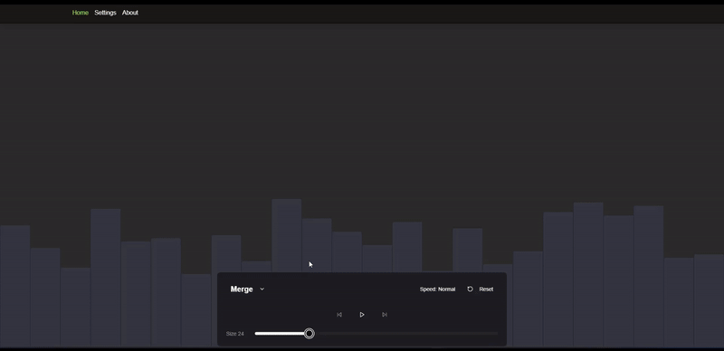

# Sorting Algorithm Visualizer

Interactive tool for visualizing sorting algorithms. Includes player functionality so you can pause, rewind, and adjust the speed of the algorithm's execution for in-depth analysis.

[Live Demo](https://sorting-visualizer-psi-inky.vercel.app/).

## Functionality

The visualizer allows users to:

- Select from a variety of sorting algorithms (e.g., Bubble Sort, Merge Sort, Quick Sort).
- Control the size of the array to be sorted.
- Adjust the speed of the visualization.
- Start, pause, and reset the sorting process.
- Observe the step-by-step execution of the chosen algorithm, with array elements highlighted during comparisons and swaps.

## Technologies Used

- **Frontend:** React with TypeScript
- **Build Tool:** Vite
- **Styling:** Tailwind CSS and Module CSS
- **Animations:** Framer Motion
- **Hosting:** Vercel

## Running Locally

1. Clone the repository: `git clone <repository_url>`
2. Navigate to the project directory: `cd sorting-visualizer`
3. Install dependencies: `npm install` or `yarn install` or `pnpm install`
4. Start the development server: `npm run dev` or `yarn dev` or `pnpm run dev`
5. Open your browser and navigate to the provided URL (usually `http://localhost:5173`).
